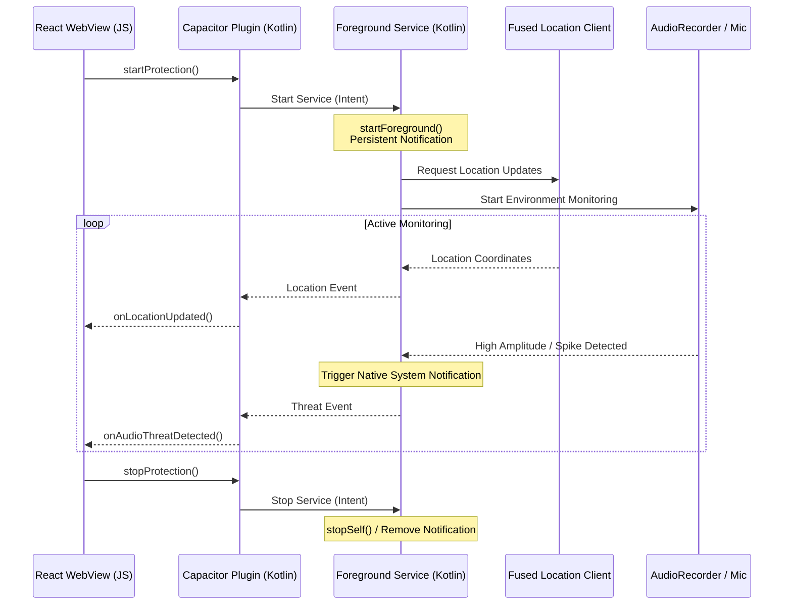

# Android Foreground Service Implementation Plan

This document outlines the architecture, Kotlin source code design, and integration steps to implement a native Android Foreground Service for StreetSentinel.

---

## 1. Native Architecture Diagram



---

## 2. Key Kotlin Components

To build the native background engine, we will implement three core Kotlin files in `android/app/src/main/java/com/streetsentinel/app/`:

### A. The Foreground Service (`StreetSentinelService.kt`)
This service runs independently of the Activity lifecycle. It manages:
* **Notification Channel**: Registers a channel with `IMPORTANCE_HIGH` for security alerts.
* **Persistent Notification**: Displays *"🛡 StreetSentinel Protection Active"* with quick actions.
* **GPS Monitoring**: Uses `FusedLocationProviderClient` to fetch coordinates.
* **Microphone Level Listener**: Analyzes audio input and measures amplitude spikes.

### B. The Capacitor Bridge Plugin (`StreetSentinelPlugin.kt`)
Exposes control methods to the React UI:
* `@PluginMethod fun startProtection(call: PluginCall)`: Instantiates and launches the service.
* `@PluginMethod fun stopProtection(call: PluginCall)`: Stops the service.
* Emits real-time background coordinates and threat detections directly to the web environment via `@NotifyMethod` events.

### C. Native Safety Notification Alerts
If the service detects an audio threat, it immediately sends a system notification with native action buttons:
1. **"I'M SAFE"**: Closes the notification and halts escalation.
2. **"SEND LOCATION NOW"**: Escalates GPS data immediately to emergency contacts via SMS/Email templates.

---

## 3. Web-to-Native Integration Code Example

Once the Capacitor plugin is written in Kotlin, we can import it in our React hook (`src/hooks/useHardwareTriggers.js`):

```javascript
import { registerPlugin } from '@capacitor/core';

// Reference our custom native bridge
const StreetSentinelPlugin = registerPlugin('StreetSentinel');

export const useHardwareTriggers = () => {
  // ...
  const toggleProtection = async (isActive) => {
    if (isActive) {
      // Start Android native foreground service
      await StreetSentinelPlugin.startProtection();
    } else {
      // Stop Android native foreground service
      await StreetSentinelPlugin.stopProtection();
    }
  };
  
  // Listen for background updates
  useEffect(() => {
    const locationListener = StreetSentinelPlugin.addListener('onLocationUpdated', (data) => {
      // Sync coordinates to Zustand store
      updateStoreLocation(data.lat, data.lng);
    });

    const threatListener = StreetSentinelPlugin.addListener('onAudioThreatDetected', (data) => {
      // Trigger emergency overlay
      triggerEmergency(data.reason, data.label, data.confidence);
    });

    return () => {
      locationListener.remove();
      threatListener.remove();
    };
  }, []);
};
```
This ensures complete code preservation, allowing the web interface to remain intact while driving native low-level background threads.
