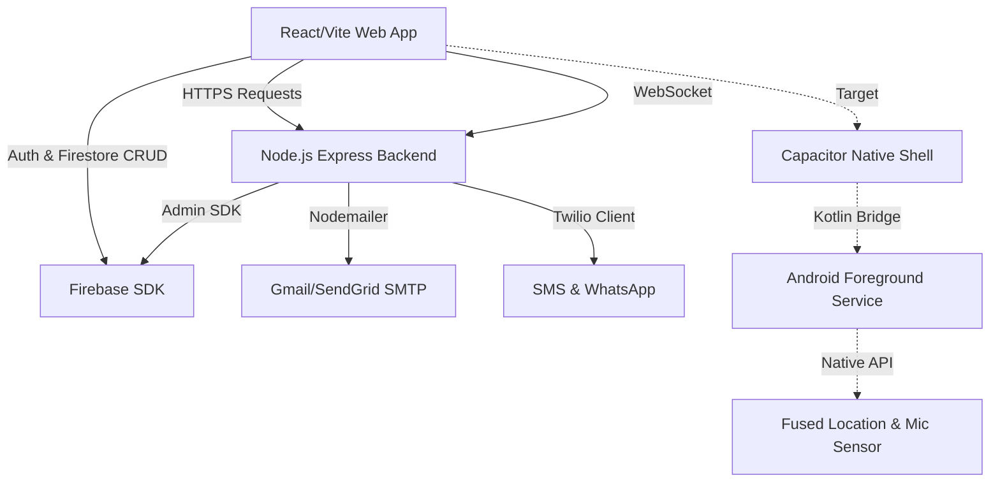

# StreetSentinel Project Audit & Analysis

This document outlines the detailed review of the StreetSentinel personal safety guardian application, covering the frontend (React/Vite), backend (Node/Express), database (Firebase Firestore), and the native Android integration.

---

## 1. Feature Classification

### WORKING 🟢
* **Firebase Authentication**: User registration, login, logout, and token generation work correctly using Firebase SDK.
* **Contacts Management**: Full CRUD (Create, Read, Update, Delete) operations for emergency contacts are supported and synchronized with Firebase Firestore (`users/{uid}/contacts`).
* **Emergency Dispatch API**: The backend `/emergency/dispatch` endpoint successfully maps coordinates to Google Maps links and broadcasts active emergencies via WebSockets.
* **Fake Call Generator**: A working overlay simulating an incoming phone call to help users escape uncomfortable situations.
* **Alert History Logs**: Fetches and displays a history of triggered alerts from Firestore (`users/{uid}/alerts`) along with email and WhatsApp delivery statuses.
* **Evidence Vault**: Displays logged incidents, including audio threat classifications (such as volume spikes or voice-triggered alerts), relative decibel levels, and timestamp data.
* **Basic GPS Geolocation**: The application captures coordinates using the HTML5 Geolocation API (`navigator.geolocation`).

### PARTIALLY WORKING 🟡
* **SafeWalk System**:
  * *What works:* Nominatim address searching, OpenStreetMap routing visualization, straight-line distance math, and basic track points.
  * *What is broken/mocked:* The ETA uses a static walking speed heuristic (`dist * 12`), and the **Check-in Timer** lacks active state monitoring or background countdown logic that triggers the SOS flow when it expires.
* **Environmental Audio Detection**:
  * *What works:* Speech Recognition (Web Speech API) correctly triggers for phrases like "help me" or "emergency". Decibel spikes are captured via Web Audio API's `AnalyserNode`.
  * *What is broken/mocked:* Sound classifications (e.g., "Screaming", "Glass Breaking") are randomly simulated upon decibel spikes. There is **no visual waveform display** in the UI.
* **Emergency Communications**:
  * *What works:* Nodemailer (SMTP/Gmail) and Twilio (SMS/WhatsApp) services are fully coded.
  * *What is broken/mocked:* Real delivery fails if API keys or Gmail App Passwords are missing or invalid in the environment configurations.

### MISSING & BROKEN 🔴
* **Android Foreground Service**: No Android folder or native project configuration currently exists. There is no native Kotlin Foreground Service to handle audio listening, background GPS tracking, and safety confirmation notifications when the app is minimized, backgrounded, or the screen is locked.
* **Background Notifications**: Browser Notification APIs are requested but are not supported when the tab is inactive due to the lack of an active Web Service Worker.
* **Nearby Safety Scanner**: The scanner to list nearby hospitals, police stations, and safety shelters via OpenStreetMap/Overpass APIs is missing.
* **Night Safety Mode**: Displays a banner after 8 PM, but does not increase microphone sensitivity, adjust risk algorithms, or run automated check-ins.
* **Shake Detection**: Relies on browser-based `devicemotion` APIs, which fail on many modern mobile browsers unless explicit permissions are requested or native bridges are used.

---

## 2. Architecture Review

### Frontend Architecture
* **Framework**: React 19 + Vite 8.
* **State Management**: Zustand (defined in `src/context/useStore.js`) syncing authentication, alerts, contacts, settings, and socket events.
* **Styling**: Tailwind CSS + Framer Motion for smooth micro-animations.
* **Maps**: Leaflet + React Leaflet rendering OpenStreetMap.

### Backend Architecture
* **Server**: Node.js + Express with Helmet, CORS security policies, and rate-limiting on critical emergency endpoints.
* **Real-time Sync**: Socket.io broadcasting emergency incidents directly to police or guardian dashboards.

---

## 3. Security Review
* **CORS Policies**: Restricted to `localhost` in development; must be configured for native origins when transitioning to Capacitor (Capacitor apps load from `localhost` or `capacitor://localhost` depending on the platform).
* **Token Verification**: Uses Firebase Admin SDK `verifyIdToken`. Includes a fallback to decode payloads directly for local development when keys are missing.
* **Input Sanitization**: Implemented on `/emergency/dispatch` to prevent header injection in Nodemailer templates.
* **PII Protection**: Masking helper masking emails and phone numbers in backend logs.

---

## 4. Performance Review
* **Audio Processing**: The Web Audio analyser utilizes a small FFT size (`256`) to maintain rapid decibel calculations without degrading interface responsiveness.
* **GPS Polling**: High accuracy tracking is configured with a `timeout: 5000` to prevent thread blocking, but can cause rapid battery depletion on mobile devices if run continuously in WebViews without native power management.

---

## 5. Mobile Transition Scope (Capacitor)
To convert this project into a native Android application without losing features:
1. **Initialize Capacitor** in the workspace.
2. **Build a Native Kotlin Foreground Service** to handle:
   * Background audio threat recording.
   * Background GPS tracking (`FusedLocationProviderClient`).
   * Persistent low-level system notifications (`NotificationChannel`).
3. **Bridge Communication** between the web app's JavaScript runtime and the native background threads.
